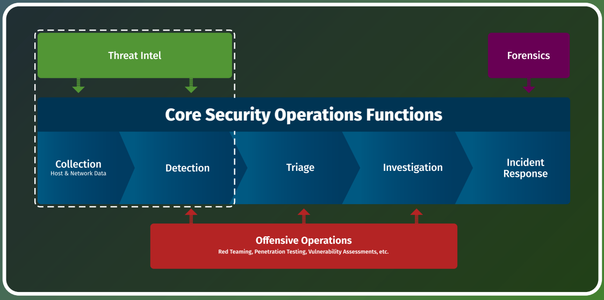
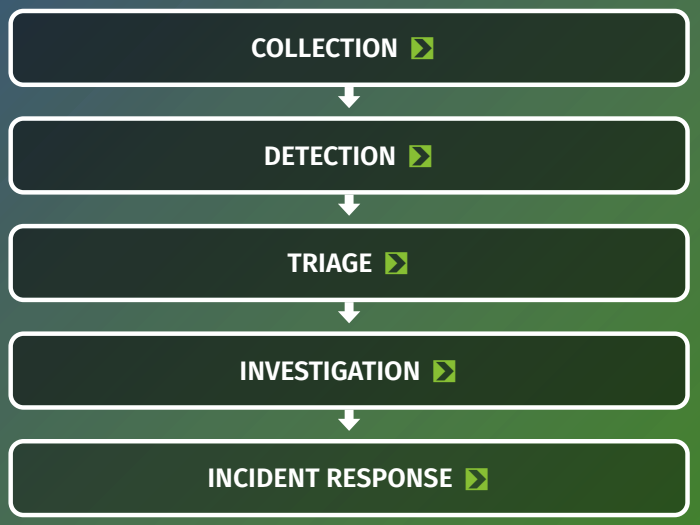

# Guide to Security Operations

## Introduction

While cyber defense is an enormously in-depth topic, there are certain mindsets, models, data sources, and techniques that can get any team started off on the right foot. This guide is a collection of some of the most useful information and models for those working in cybersecurity operations centers, as well as pointers to some incredibly powerful free tools, book references, and more to help build your team, skills, and defensive capabilities.

サイバー防御は非常に奥の深いテーマだが、どんなチームでも正しいスタートを切ることができる特定の考え方、モデル、データソース、テクニックがある。このガイドは、サイバーセキュリティ・オペレーション・センターで働く人々にとって最も有用な情報やモデルを集めたものであり、チームやスキル、防御能力を構築するのに役立つ、非常に強力な無料ツールや参考書籍などへのポインタも含まれている。

## Table of Contents

* [SOC Functions](#SOC-Functions)
  * [SOC Functions Diagram](#SOC-Functions-Diagram)
  * [SOC Core Functions](#SOC-Core-Functions)

## SOC Functions

SOCの機能

When breaking down how a Security Operations Center functions, it can be helpful to decompose the complex workflow of events into atomic functions so that each can be studied. In any complex system (including SOCs), each function of a process has a specific set of inputs and outputs that can be generalized, understood, and measured to assess whether that component is performing as intended. Breaking down the components and tasks of a SOC in this way helps describe in clear detail exactly what a security team must do in order to succeed as well as how other groups and functions interact with the SOC core functions to provide all services necessary for success in cyber defense.

セキュリティオペレーションセンターがどのように機能するかを分解するとき、イベントの複雑なワークフローを原子機能に分解し、それぞれを調査できるようにすることが役に立つ。どのような複雑なシステム（SOC を含む）でも、プロセスの各機能には特定の入力と出力のセットがあり、それを一般化し、理解し、測定することで、そのコンポーネントが意図したとおりに機能しているかどうかを評価することができる。SOC のコンポーネントとタスクをこのように分解することで、セキュリティチームが成功するために何をしなければならないか、また、他のグループや機能が SOC の中核機能とどのように相互作用し、サイバー防衛の成功に必要なすべてのサービスを提供するのかを明確に詳細に説明することができる。

The following is a list of SOC core functions - tasks that commonly fall under the "SOC" organization, although this may, of course, vary from team to team depending on a number of factors. Each is listed with inputs, outputs, and that function's goals, as well as interactions with other groups. "Auxiliary functions" are also listed. These are capabilities that less commonly fall under the SOC organization directly, but often operate very closely with the security operations team to ensure that the organization is secure.

以下は、SOCのコアファンクション（一般的に「SOC」組織の下に位置づけられるタスク）のリストである。それぞれ、インプット、アウトプット、その機能の目標、他のグループとの相互作用が記載されている。「補助機能」もリストアップされている。これらは、SOC 組織に直接属することはあまりないが、セキュリティ運用チームと密接に連携して組織のセキュリティを確保することが多い機能である。

### SOC Functions Diagram

SOC機能図

In the diagram below, core functions are drawn in solid boxes while auxiliary functions are in dashed outlines. The placement of the auxiliary functions in the diagram is not to be taken as an organizational chart recommendation, but merely to show the inputs from those groups/functions to the core tasks of the SOC. An important item to note is that since these functions form a serialized chain of inputs and outputs, failure to perform the earlier items in the process will have ramifications on capabilities further down the line. This means that functions earlier in the process should be optimized and focused on to ensure the best possible outcome.

下図では、中核機能は実線で、補助機能は破線で描かれている。この図における補助機能の配置は、組織図として推奨されるものではなく、単にそれらのグループ／機能から SOC の中核的なタスクへの入力を示すものである。注意すべき重要な項目は、これらの機能はインプットとアウトプットの直列化された連鎖を形成しているため、プロセスの初期項目の実行に失敗すると、さらに下位の機能に影響が及ぶということである。つまり、可能な限り最良の結果を確実にするためには、プロセスの早い段階で機能を最適化し、集中的に取り組むべきである。

### SOC Core Functions

The following are the deconstructed pieces of running a Security Operations Center and are listed as “core” activities that the average cyber defense team is responsible for. The section that follows will discuss each function, its goals, and how to predict that function's effectiveness.

以下は、セキュリティ・オペレーション・センターの運営を分解したものであり、平均的なサイバー防衛チームが担当する「中核的」活動として列挙されている。以下のセクションでは、各機能、その目標、およびその機能の有効性を予測する方法について説明する。

## References

https://www.sans.org/posters/guide-to-security-operations/
